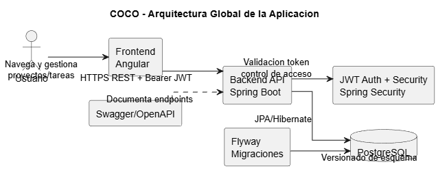

# Arquitectura Global - COCO

## Resumen

COCO combina una SPA en Angular con un backend Spring Boot y persistencia PostgreSQL.

- Frontend: Angular 20.
- Backend: Java 21 + Spring Boot.
- Datos: PostgreSQL + Flyway.
- Seguridad: JWT stateless + autorizacion por proyecto.

## Arquitectura actual (as-is)



Fortalezas:
- Separacion por capas en backend.
- Contrato de error centralizado.
- Seguridad integrada en cadena de filtros.
- CI definida en GitHub Actions.

Limites:
- Frontend con partes aun en fase parcial.
- Contrato API sin versionado explicito por ruta.
- Observabilidad basica.

## Arquitectura objetivo (to-be)

Objetivo: mantener simplicidad de portfolio, con decisiones que escalen a contexto profesional.

```text
[Angular SPA] -> [Spring Boot API] -> [PostgreSQL]
                    |- AuthN/AuthZ
                    |- Use cases + dominio
                    |- Error contract estable
                    |- Observabilidad (logs/metricas/traceId)
                    `- Gobierno de contrato API (OpenAPI)
```

## Decisiones recomendadas

1. Versionar API (`/api/v1`).
2. Estabilizar modelo de error (`code`, `message`, `details`, `traceId`).
3. Auditoria de operaciones sensibles.
4. Validar contrato frontend-backend en CI.
5. Mejorar telemetria para diagnostico.

## Referencias

- Roadmap: `architecture/improvement-roadmap.md`
- Backend: `../backend/architecture.md`
- Frontend: `../frontend/architecture.md`
- Database: `../database/schema.md`