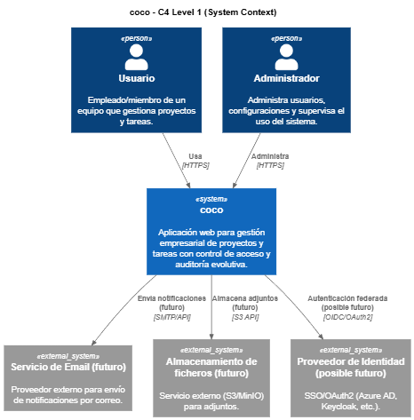
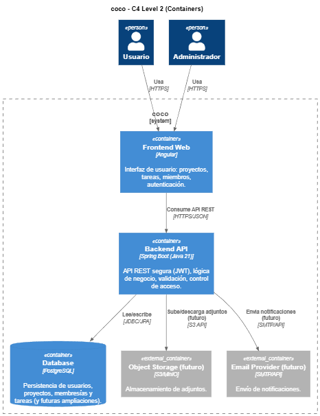
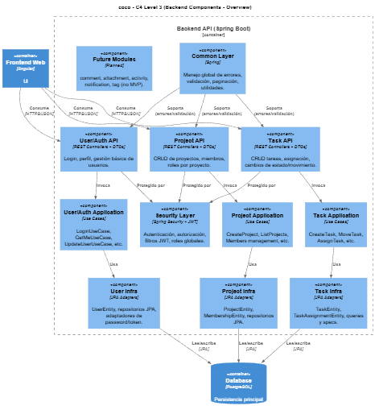
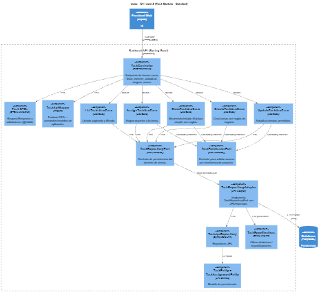

# C4 – Level 1: System Context

--
# C4 – Level 2: Containers

--
# C4 – Level 3: Components (del Backend API)

## 3.1 Component Diagram – Vista general del backend

-- 
## 3.2 Component Diagram – Detalle por módulo (ejemplo: `task`)

