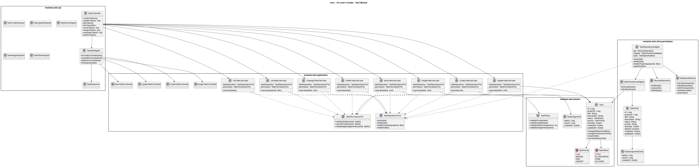

# C4 - Level 1: System Context

Este diagrama muestra el sistema en su entorno: usuarios, sistemas externos y los principales flujos de comunicacion. Sirve para entender el alcance, dependencias y limites del producto.

# C4 - Level 2: Containers

Vista de alto nivel de los contenedores que componen la solucion (por ejemplo: API, base de datos, servicios externos, colas). 
Muestra responsabilidades y protocolos de comunicacion entre ellos.

# C4 - Level 3: Components (del Backend API)

Detalle de los principales componentes dentro del backend y como colaboran para cumplir cada caso de uso.

## 3.1 Component Diagram - Vista general del backend

Panorama general de componentes, mostrando dependencias internas y puntos de integracion clave.

## 3.2 Component Diagram - Detalle por modulo (ejemplo: `task`)

Zoom a un modulo especifico para clarificar subcomponentes, responsabilidades y sus relaciones.

# C4 - Level 4: Code (`Task Module`)

Diagrama de paquetes y clases clave. Este nivel ayuda a la implementacion y mantenimiento del modulo.

